# ByteLearn - System Architecture

## Overview

ByteLearn is an on-premise digital learning platform designed for low-resource educational environments. The system follows a modern client-server architecture with a Django REST API backend and Next.js frontend.

---

## High-Level System Architecture

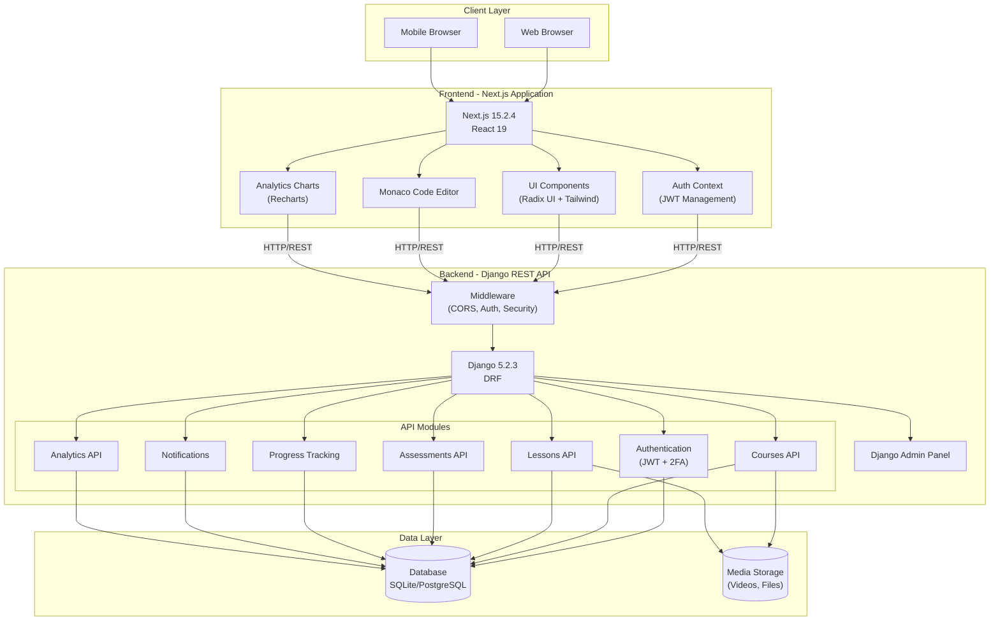

---

## Component Architecture

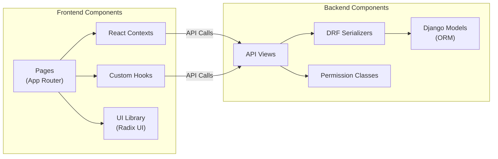

---

## Data Flow Architecture

### Authentication Flow

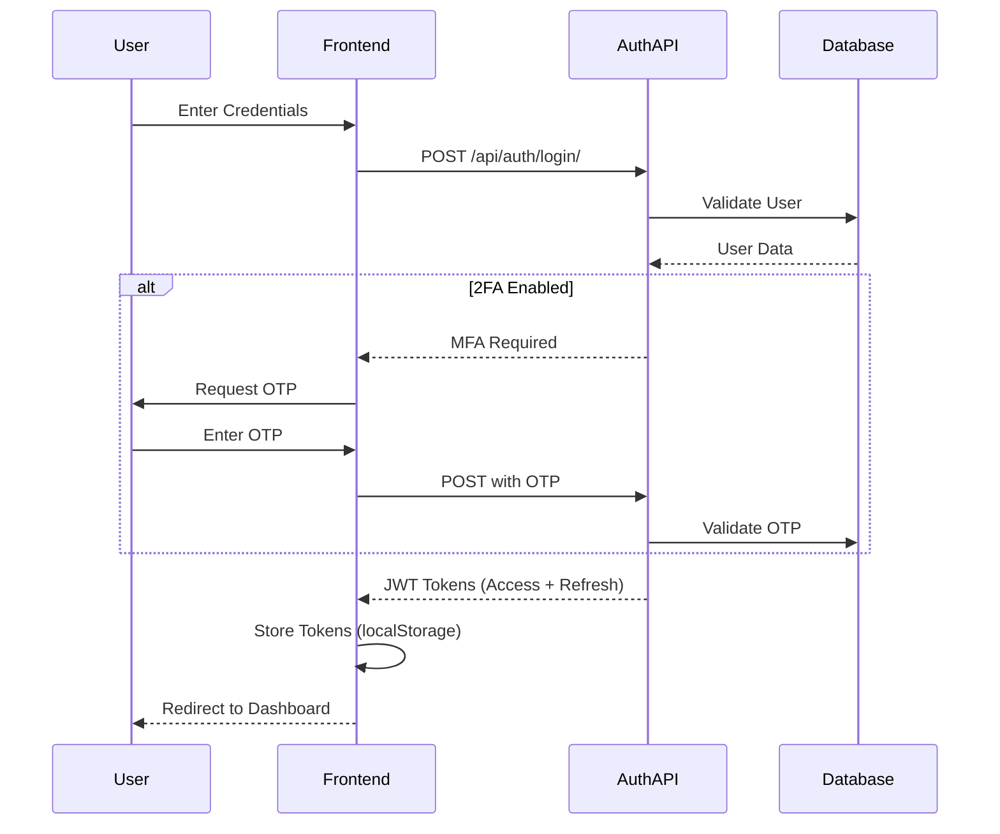

### Course Content Flow

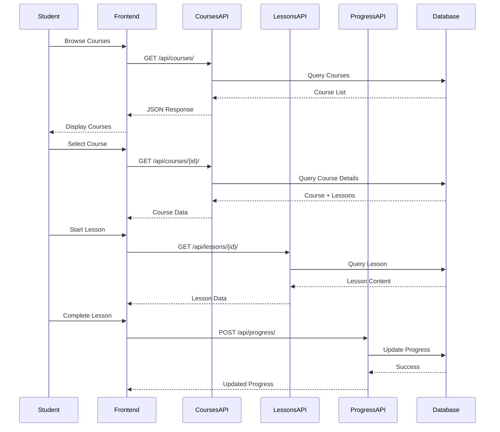

### Code Execution Flow

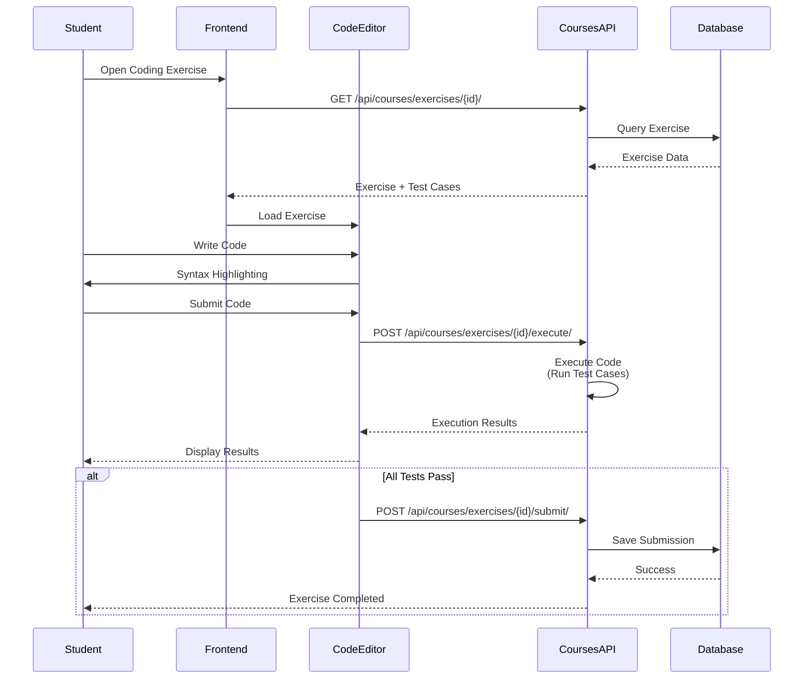

---

## Database Schema Overview

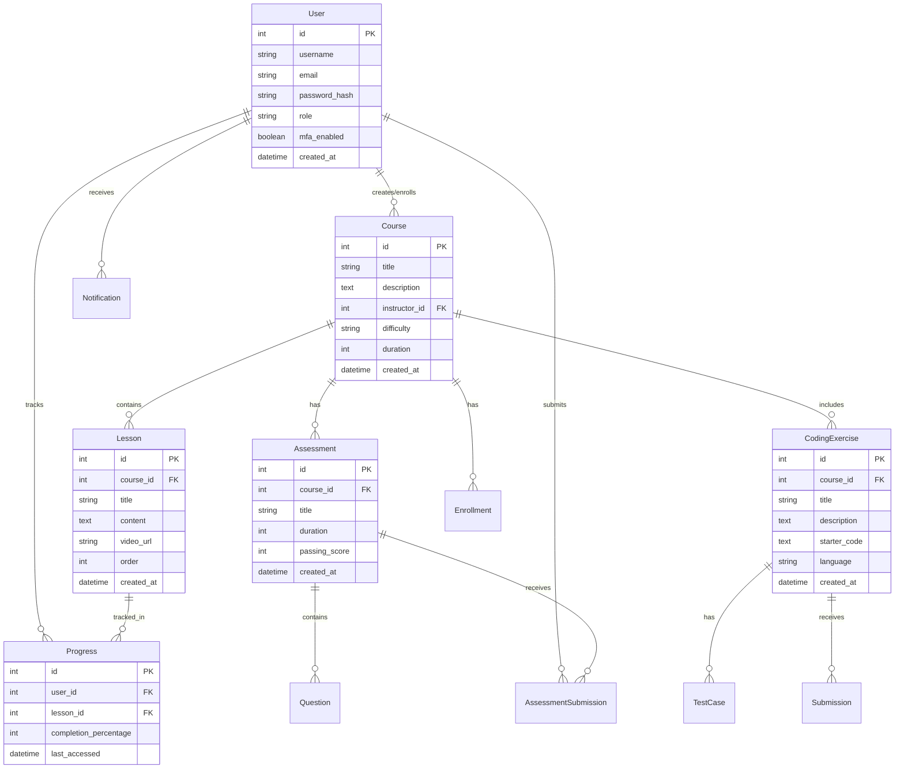

---

## Deployment Architecture

### Development Environment

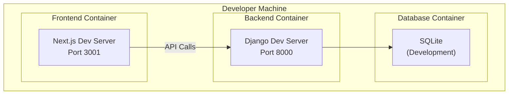

### Docker Compose Architecture

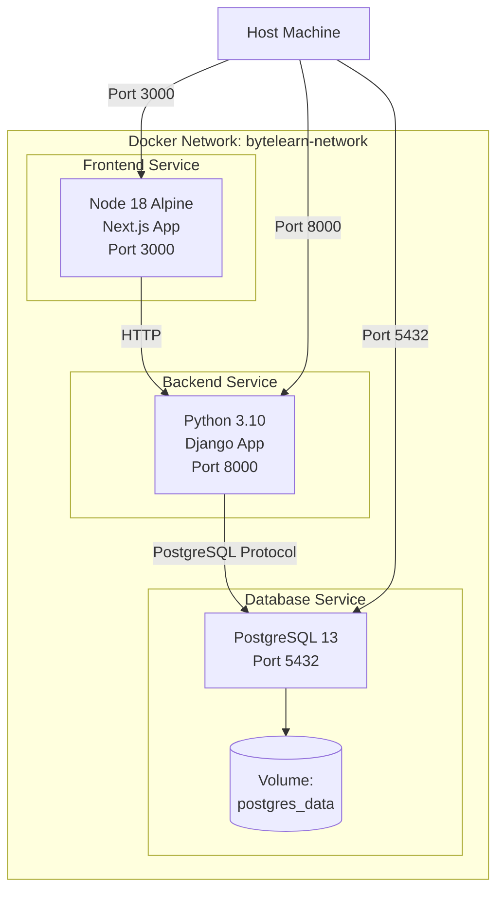

### Production Architecture (Recommended)

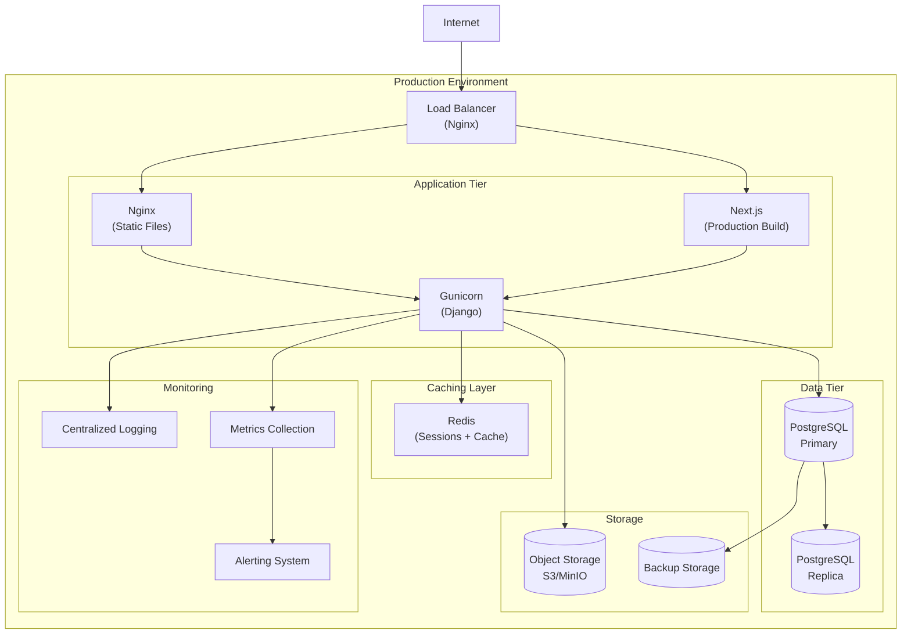

---

## API Architecture

### REST API Endpoints Structure

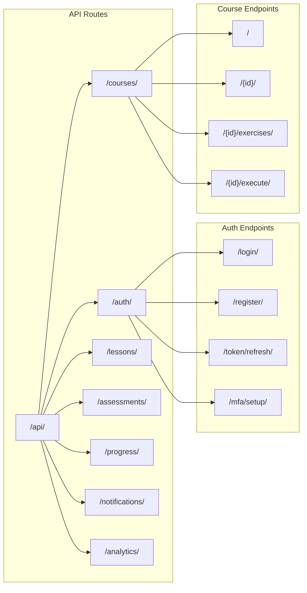

---

## Technology Stack Details

### Frontend Stack

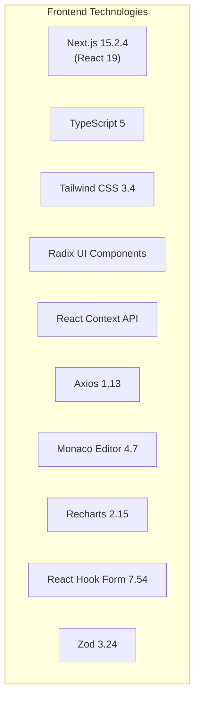

### Backend Stack

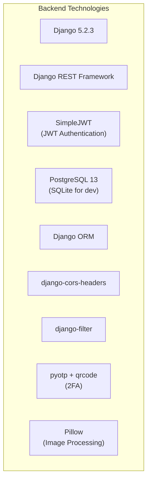

---

## Security Architecture

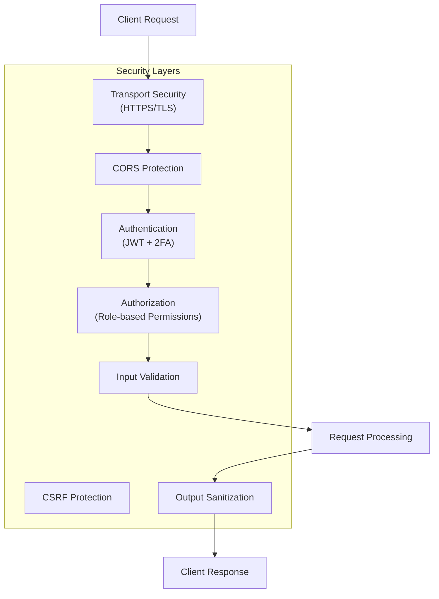

---

## User Roles & Permissions

```mermaid
graph TB
    subgraph "User Roles"
        Admin["Administrator"]
        Instructor["Instructor"]
        Student["Student"]
    end
    
    subgraph "Admin Permissions"
        AdminP1["Manage All Users"]
        AdminP2["Manage All Courses"]
        AdminP3["View System Analytics"]
        AdminP4["Configure System Settings"]
    end
    
    subgraph "Instructor Permissions"
        InstructorP1["Create/Edit Own Courses"]
        InstructorP2["Create Lessons & Assessments"]
        InstructorP3["View Student Progress"]
        InstructorP4["Grade Submissions"]
    end
    
    subgraph "Student Permissions"
        StudentP1["Enroll in Courses"]
        StudentP2["View Course Content"]
        StudentP3["Submit Assessments"]
        StudentP4["Track Own Progress"]
    end
    
    Admin --> AdminP1
    Admin --> AdminP2
    Admin --> AdminP3
    Admin --> AdminP4
    
    Instructor --> InstructorP1
    Instructor --> InstructorP2
    Instructor --> InstructorP3
    Instructor --> InstructorP4
    
    Student --> StudentP1
    Student --> StudentP2
    Student --> StudentP3
    Student --> StudentP4
```

---

## File Structure

### Backend Structure
```
backend/
├── api/
│   ├── analytics/          # Analytics & reporting
│   ├── assessments/        # Quizzes & tests
│   ├── authapi/           # Authentication & authorization
│   ├── courses/           # Course management
│   ├── lessons/           # Lesson content
│   ├── notifications/     # User notifications
│   ├── progress/          # Progress tracking
│   └── permissions.py     # Shared permissions
├── base/
│   ├── settings.py        # Django configuration
│   ├── urls.py           # URL routing
│   └── wsgi.py           # WSGI application
├── media/                 # Uploaded files
├── db.sqlite3            # SQLite database (dev)
├── manage.py             # Django management
├── requirements.txt      # Python dependencies
└── Dockerfile            # Docker configuration
```

### Frontend Structure
```
frontend/
├── app/                   # Next.js App Router
│   ├── analytics/        # Analytics dashboard
│   ├── courses/          # Course pages
│   ├── dashboard/        # User dashboard
│   ├── login/           # Login page
│   ├── progress/        # Progress tracking
│   └── layout.tsx       # Root layout
├── components/           # React components
│   ├── analytics-charts.tsx
│   ├── code-editor.tsx
│   ├── ui/              # Radix UI components
│   └── ...
├── contexts/            # React contexts
│   └── auth-context.tsx
├── lib/                 # Utilities
│   ├── api.ts          # API client
│   └── utils.ts        # Helper functions
├── types/              # TypeScript types
├── public/             # Static assets
├── package.json        # Dependencies
├── tsconfig.json       # TypeScript config
├── tailwind.config.ts  # Tailwind config
└── Dockerfile          # Docker configuration
```

---

## Key Features Architecture

### 1. Course Management
- Create, read, update, delete courses
- Organize lessons within courses
- Attach assessments and coding exercises
- Track enrollment and progress

### 2. Learning Content Delivery
- Video lessons with playback
- Text-based content (Markdown support)
- Interactive coding exercises
- Multiple-choice assessments

### 3. Code Execution Environment
- Monaco editor integration
- Server-side code execution
- Test case validation
- Real-time feedback

### 4. Progress Tracking
- Lesson completion tracking
- Assessment scores
- Course progress percentage
- Learning analytics

### 5. Analytics & Reporting
- Student performance metrics
- Instructor dashboards
- System-wide analytics
- Progress visualization

### 6. Authentication & Security
- JWT-based authentication
- Two-factor authentication (2FA)
- Role-based access control
- Session management

---

## Performance Considerations

### Current Implementation
- SQLite for development (single-file database)
- Django development server (single-threaded)
- Next.js development mode (hot reload)
- No caching layer
- Direct file storage

### Production Recommendations
- PostgreSQL with connection pooling
- Gunicorn with multiple workers
- Next.js production build (optimized)
- Redis for caching and sessions
- CDN for static assets
- Object storage for media files

---

## Scalability Strategy

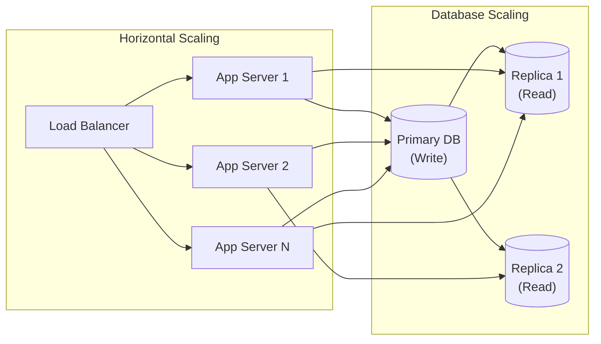

---

**Built for the Africa Sustainable Classroom Challenge**  
**Architecture Version**: 1.0  
**Last Updated**: 2026-01-15
